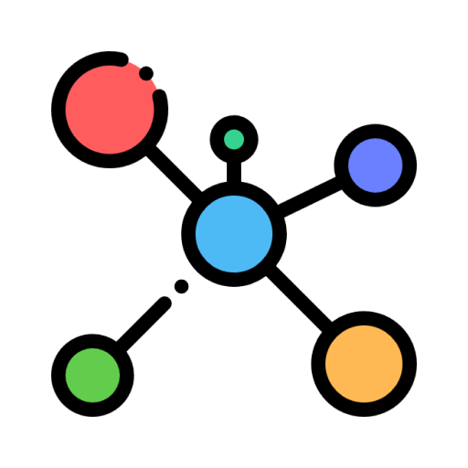

# gopkgview - Go dependency visualization

<p align="center">
  
   <br />
</p>

<p align="center">
  
  
  
</p>

## Overview

**gopkgview** is an interactive tool designed to visualize and analyze Go project dependencies. It provides a rich, web-based interface for better understanding of how your project connects its components and external libraries.

Implemented with [ELK's](https://github.com/kieler/elkjs) layout algorithms to arrange the graphs and [React Flow](https://reactflow.dev/) to make the visualization interactive and user-friendly.

> go mod graph... doesn't show... a graph.  
> gopkgview does.
>
> -- <cite><a href="https://newsletter.appliedgo.net/archive/dont-mess-with-that-property/">The Applied Go Weekly Newsletter</a></cite>

Example of visualization of [lazydocker](https://github.com/jesseduffield/lazydocker):

https://github.com/user-attachments/assets/d9715b85-9f77-4b2e-8ef4-1581071f1e66

## Features

- **Support latest Go version**
- **Interactive web-based visualization** - Real-time exploration of dependencies
- **Toggle dependencies by type** - Filter standard library, external, and local packages
- **Focus on specific dependencies** - Drill down into particular packages for detailed analysis
- **Multiple installation options** - `go install`, binary download, or Docker

## Installation

### Option 1: Install via `go install`

```bash
go install github.com/grishy/gopkgview@latest
```

### Option 2: Download the Release

Download the latest binary from the [Releases Page](https://github.com/grishy/gopkgview/releases).

### Option 3: Run with Docker

```bash
docker run -p 8080:8080 -v $(pwd):/app ghcr.io/grishy/gopkgview:latest
```

## Quick Start

Navigate to your Go project directory and run:

```bash
cd my-go-project
gopkgview
```

This will start a web server with the dependency visualization available in your browser. By default it opens your default browser; use `--skip-browser` if you prefer to launch it manually.

## Parameters

### Available Flags

| Flag               | Description                                                                                                                               |
| ------------------ | ----------------------------------------------------------------------------------------------------------------------------------------- |
| `--root`           | From which directory find go.mod <br> ‣ Default: `./` <br> ‣ Environment Variable: `GO_PKGVIEW_ROOT`                                      |
| `--gomod`          | Path to go.mod <br> ‣ Default: Auto-detected <br> ‣ Environment Variable: `GO_PKGVIEW_GOMOD`                                              |
| `--addr`           | Address to listen on <br> ‣ Default: `:0` (random port) <br> ‣ Environment Variable: `GO_PKGVIEW_ADDR`                                    |
| `--max-goroutines` | Maximum number of goroutines to use for parsing in parallel <br> ‣ Default: `20` <br> ‣ Environment Variable: `GO_PKGVIEW_MAX_GOROUTINES` |
| `--skip-browser`   | Don't open browser on start <br> ‣ Default: `false` <br> ‣ Environment Variable: `GO_PKGVIEW_SKIP_BROWSER`                                |
| `--help`, `-h`     | Show help                                                                                                                                 |
| `--version`, `-v`  | Print the version                                                                                                                         |

### Example Usage

```bash
# Analyze a specific directory
gopkgview --root ./path/to/project

# Use a specific go.mod file
gopkgview --gomod ./path/to/go.mod
```

## Release Process

Reminder for me, just create a tag and push it.

```bash
# Replace 1.2.0 with the new version in project
git tag -a v1.2.0 -m "Release v1.2.0"
git push origin tag v1.2.0
```

## Alternatives

- [go-callvis](https://github.com/ondrajz/go-callvis) - Great tool for visualizing of call, but panic on Go >= 1.21
- [godepgraph](https://github.com/kisielk/godepgraph) - Same idea, but output is static image
- [depgraph](https://github.com/becheran/depgraph) - Inspire me to create this tool
- [gomod](https://github.com/Helcaraxan/gomod)

## License

© 2025 [Sergei G.](https://github.com/grishy)
This project is licensed under the [GPL-3.0 license](./LICENSE).
